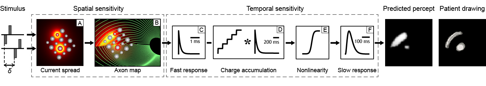

[](https://coveralls.io/github/uwescience/pulse2percept?branch=master)


# pulse2percept: A Python-based simulation framework for bionic vision

## Summary

By 2020 roughly 200 million people will suffer from retinal diseases such as
macular degeneration or retinitis pigmentosa. Consequently, a variety of retinal
sight restoration procedures are being developed to target these diseases.
Electronic prostheses (currently being implanted in patients) directly stimulate
remaining retinal cells using electrical current, analogous to a cochlear
implant. Optogenetic prostheses (soon to be implanted in human) use optogenetic
proteins to make remaining retinal cells responsive to light, then use light
diodes (natural illumination is inadequate) implanted in the eye to stimulate
these light sensitive cells.

However, these devices do not restore anything resembling natural vision:
Interactions between the electronics and the underlying neurophysiology result
in significant distortions of the perceptual experience.

We have developed a computer model that has the goal of predicting the perceptual
experience of retinal prosthesis patients.
The model was developed using a variety of patient data describing the brightness
and shape of phosphenes elicited by stimulating single electrodes, and validated
against an independent set of behavioral measures examining spatiotemporal
interactions across multiple electrodes.

The model takes as input a series of (simulated) electrical pulse trains---one pulse
train per electrode in the array---and converts them into an image sequence that
corresponds to the predicted perceptual experience of a patient:



If you use pulse2percept in a scholary publication, please cite as:
> M Beyeler, GM Boynton, I Fine, A Rokem (2017). pulse2percept: A Python-based
> simulation framework for bionic vision. Proceedings of the 16th Python in
> Science Conference, p.81-88,
> doi:[10.25080/shinma-7f4c6e7-00c](https://doi.org/10.25080/shinma-7f4c6e7-00c).

Or use the following BibTex:
```
@InProceedings{ BeyelerSciPy2017,
  author    = { {M}ichael {B}eyeler and {G}eoffrey {M}. {B}oynton and {I}one {F}ine and {A}riel {R}okem },
  title     = { pulse2percept: {A} {P}ython-based simulation framework for bionic vision },
  booktitle = { {P}roceedings of the 16th {P}ython in {S}cience {C}onference },
  pages     = { 81 - 88 },
  year      = { 2017 },
  doi       = { 10.25080/shinma-7f4c6e7-00c },
  editor    = { {K}aty {H}uff and {D}avid {L}ippa and {D}illon {N}iederhut and {M} {P}acer }
}
```

Scientific studies referencing pulse2percept:
- JR Golden, C Erickson-Davis, NP Cottaris, N Parthasarathy, F Rieke, DH Brainard, BA Wandell, EJ Chichilnisky (2018): Simulation of visual perception and learning with a retinal prosthesis. *bioRxiv 206409*, [doi:10.1101/206409](https://doi.org/10.1101/206409).
- J Steffen, J Napp, S Pollmann and K Tönnies (2018). Perception Enhancement for Bionic Vision - Preliminary Study on Object Classification with Subretinal Implants. *Proceedings of the 7th International Conference on Pattern Recognition Applications and Methods, 169-177*. [doi:10.5220/0006648901690177](https://doi.org/10.5220/0006648901690177)


## Installation

### Prerequisites
pulse2percept requires the following software installed for your platform:

1. [Python](http://www.python.org) 2.7 or >= 3.4

2. [NumPy](http://www.numpy.org)

3. [SciPy](http://www.scipy.org)

4. [JobLib](https://github.com/joblib/joblib)

5. [scikit-image](http://scikit-image.org/)

Optional packages:

1. [Dask](https://github.com/dask/dask) for parallel processing
   (a joblib alternative). Use conda to install.

2. [Numba](http://numba.pydata.org/). Use conda to install.

4. [ffmpeg codec](http://adaptivesamples.com/how-to-install-ffmpeg-on-windows)
   if you're on Windows and want to use functions in the `files`
   module.


### Stable version

The latest stable release of pulse2percept can be installed with pip:
```
$ pip install pulse2percept
```


### Development version

In order to get the bleeding-edge version of pulse2percept,
use the commands:

```
$ git clone https://github.com/uwescience/pulse2percept.git
$ cd pulse2percept
$ python setup.py install
```

To test pulse2percept after installation, execute in Python:
```
>>> import pulse2percept
```

### Getting started

A number of useful examples can be found in the "examples/notebooks"
folder, including the following:

- [0.0-example-usage.ipynb](https://github.com/uwescience/pulse2percept/blob/master/examples/notebooks/0.0-example-usage.ipynb): How to use the model.

- [0.1-image2percept.ipynb](https://github.com/uwescience/pulse2percept/blob/master/examples/notebooks/0.1-image2percept.ipynb): How to convert an image to a percept.

Detailed documentation can be found at [uwescience.github.io/pulse2percept](https://uwescience.github.io/pulse2percept).
